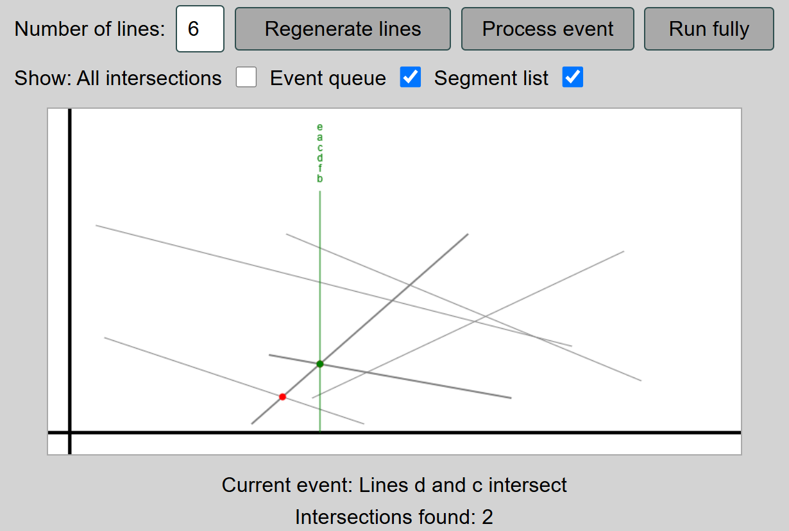

# Sweepline Demo

This page is a demonstration of the [sweepline technique](https://en.wikipedia.org/wiki/Sweep_line_algorithm) on the line intersection problem.

You can initialize some number of lines from 1 to 20. The "Process event" line lets you step through the algorithm while "Run fully" runs the entire algorithm from start to finish. You can also toggle options for displaying various parts of the algorithm.

The demo is hosted online at https://www.cs.cmu.edu/~15451-f24/demos/sweepline/index.html as it was originally made for CMU's 15-451 (Algorithm Design and Analysis) and was used in a guest lecture I presented.

Sources used:

No major sources. Citations for minor functionality (such as jQuery) are linked where necessary.